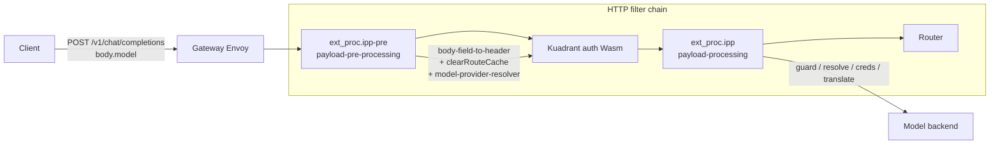
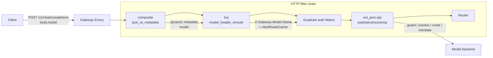
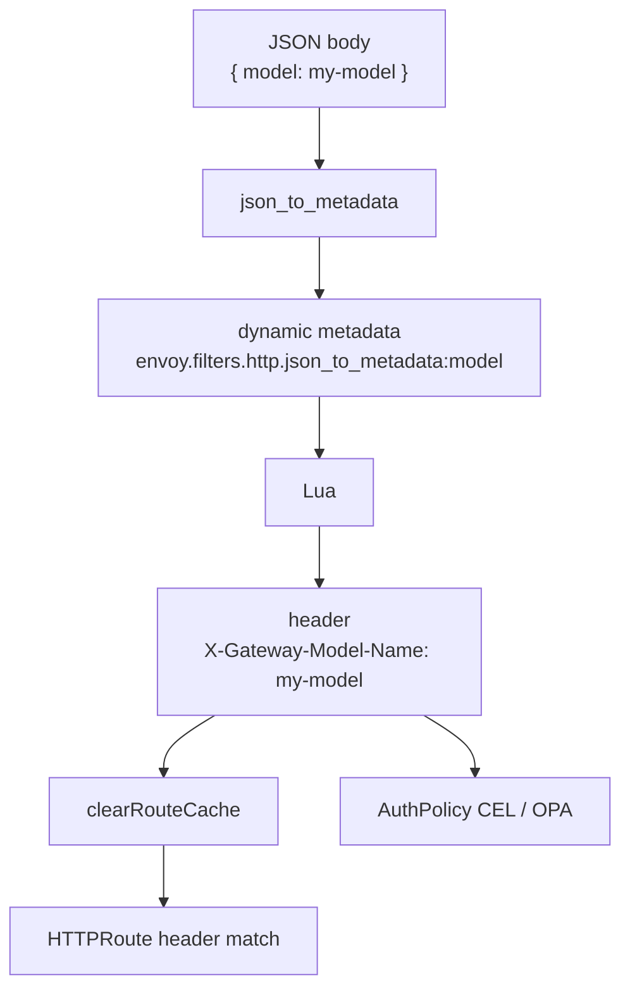
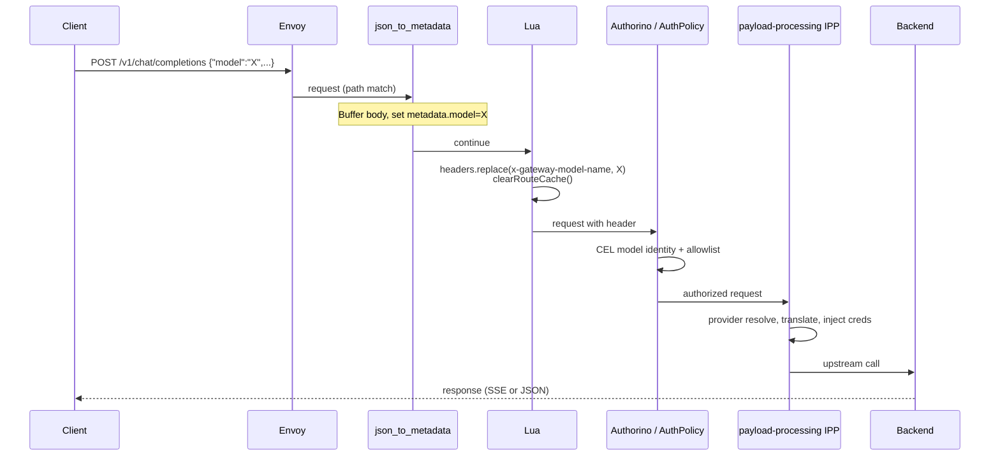

# Pre-auth model extraction (json_to_metadata + Lua)

Design notes for replacing the **payload-pre-processing** / `ext_proc.ipp-pre` hop with an in-Envoy filter chain, while keeping post-auth Inference Payload Processing (IPP) for provider resolve, credentials, and API translation.

User-facing inference docs: [Inference](docs/content/user-guide/inference.md).

---

## Problem

Body-based OpenAI routes (`POST /v1/chat/completions` with `"model": "..."` in JSON) need the gateway to:

1. Learn the model identity **before** Kuadrant/Authorino auth (AuthPolicy CEL / OPA reads `x-gateway-model-name`).
2. Re-match HTTPRoutes that select backends via the `X-Gateway-Model-Name` header (`clearRouteCache`).

Previously that was a dedicated gRPC **ext_proc** service (`payload-pre-processing`) inserted before auth.

---

## Before → after

### Before (IPP-pre + IPP)



| Stage | Component | Role |
|-------|-----------|------|
| Pre-auth | `payload-pre-processing` + `ext_proc.ipp-pre` | `body.model` → `X-Gateway-Model-Name`, ClearRouteCache, early provider resolve |
| Auth | WasmPlugin / `envoy.filters.http.wasm` | Token / API key; CEL on model header |
| Post-auth | `payload-processing` + `ext_proc.ipp` | Headers guard, provider resolve, translation, API key injection |

### After (json_to_metadata + Lua + IPP)



| Stage | Component | Role |
|-------|-----------|------|
| Pre-auth | `envoy.filters.http.composite.model_from_body` | Path-gated json_to_metadata: extract `model` into dynamic metadata |
| Pre-auth | `envoy.filters.http.lua.model_header_reroute` | Metadata → `X-Gateway-Model-Name` + `clearRouteCache()` |
| Auth | unchanged | Still reads header / path CEL |
| Post-auth | `ext_proc.ipp` only | Provider resolve and the rest of IPP (no `payload-pre-processing` Deployment) |

**Removed:** `payload-pre-processing` Deployment / Service / DestinationRule, and `ext_proc.ipp-pre` filter inserts.

---

## Why two filters (not json_to_metadata alone)

[Envoy Json-To-Metadata](https://www.envoyproxy.io/docs/envoy/latest/configuration/http/http_filters/json_to_metadata_filter) only writes **dynamic metadata**. It does **not**:

- Set an HTTP request header AuthPolicy / HTTPRoute can match on
- Call `clearRouteCache()` so Envoy re-evaluates routes after the header appears



Composite wraps json_to_metadata so it only runs on inference path suffixes:

- `/v1/chat/completions`
- `/v1/completions`

Non-inference routes (`/v1/models`, `/v1/api-keys`, …) skip body parsing. Lua no-ops when metadata is absent.

---

## Request path (detail)



### Auth vs provider resolution

- **Auth needs the header** — still set **before** auth (Lua).
- **`model-provider-resolver`** reads that header (it does not set it) and loads ExternalModel / provider state for later IPP plugins. It now runs only in **post-auth** IPP. That is intentional: AuthPolicy never depended on provider CR lookup.

---

## EnvoyFilter shape

Manifest: [`deployment/base/payload-processing/manager/envoy-filter.yaml`](deployment/base/payload-processing/manager/envoy-filter.yaml)

- `spec.priority: 10` — apply after Kuadrant’s wasm insert (priority 0).
- Dual anchors (only one stack matches per cluster):
  - ODH / community: `extensions.istio.io/wasmplugin/...`
  - RHCL 1.4: `envoy.filters.http.wasm`
- Per stack: `INSERT_BEFORE` composite, `INSERT_BEFORE` Lua, `INSERT_AFTER` `ext_proc.ipp`.
- Per-route MERGE disables post-auth IPP on non-inference `maas-api-route` rules.

Controller patcher: [`maas-controller/pkg/platform/tenantreconcile/params.go`](maas-controller/pkg/platform/tenantreconcile/params.go) (`patchPayloadProcessingEnvoyFilter`) — 6 filter patches + 4 route disables; gRPC cluster rewritten only on the IPP inserts.

Live check: [`scripts/check-payload-ext-proc-filters.sh`](scripts/check-payload-ext-proc-filters.sh)

```bash
./scripts/check-payload-ext-proc-filters.sh
# Expect order: composite.model_from_body → lua.model_header_reroute → auth → ext_proc.ipp → router
```

---

## Body buffering (harden before production)

json_to_metadata **stops the filter chain until the full request body is buffered**. Downstream `ext_proc` configured with `request_body_mode: FULL_DUPLEX_STREAMED` expects live chunks and can see empty / EOS-only bodies (validated on client-1: routing header correct, upstream body empty until IPP was removed from the chain).

**Production shape for post-auth IPP** (in `envoy-filter.yaml`):

| Direction | Mode | Reason |
|-----------|------|--------|
| Request | `BUFFERED` | Body already fully available; IPP plugins need whole JSON |
| Response | `FULL_DUPLEX_STREAMED` | Keep SSE / streaming responses |

`mode_override` cannot fix this while request mode stays `FULL_DUPLEX_STREAMED` (unsupported for that mode in Envoy).

---

## Files touched (this change)

| Area | Files |
|------|--------|
| EnvoyFilter / kustomize | `deployment/base/payload-processing/manager/envoy-filter.yaml`, `kustomization.yaml` (drop `../pre-processing`), `plugins-configmap.yaml`, `networking/networkpolicy.yaml` |
| Controller | `maas-controller/pkg/platform/tenantreconcile/params.go`, `params_test.go` |
| Tooling / e2e | `scripts/check-payload-ext-proc-filters.sh`, `test/e2e/tests/*`, `test/e2e/scripts/LOCAL-DEPLOY.md` |

The `deployment/base/payload-processing/pre-processing/` tree is unused by kustomize (left for cleanup / reference).

---

## Cluster validation snapshot (client-1)

- Filter chain check script: **pass**
- Echo HTTPRoute matching `X-Gateway-Model-Name: echo-test-model`:
  - `body.model=echo-test-model` → **200** with `model_header` set (no client-sent header)
  - wrong / missing model → **404**
- With both json_to_metadata and FULL_DUPLEX IPP: header OK, body sometimes empty → drives the BUFFERED request harden above

---

## Related links

- [Envoy Json-To-Metadata](https://www.envoyproxy.io/docs/envoy/latest/configuration/http/http_filters/json_to_metadata_filter)
- [Envoy Lua `clearRouteCache`](https://www.envoyproxy.io/docs/envoy/latest/configuration/http/http_filters/lua_filter.html#clearroutecache)
- Usage-logs composite pattern (same json_to_metadata style): `deployment/components/observability/usage-logs/envoy-otel-access-log.yaml`
