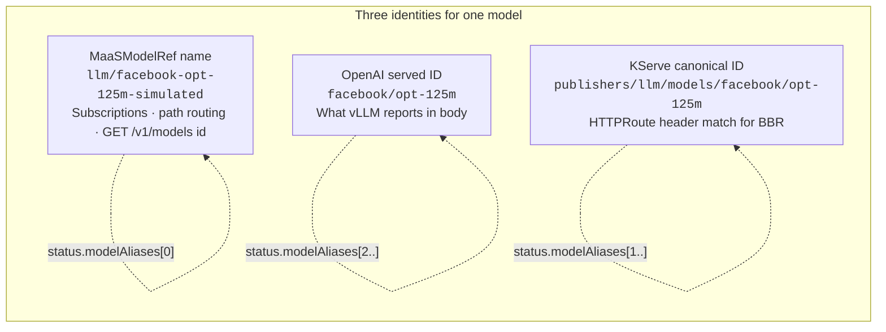
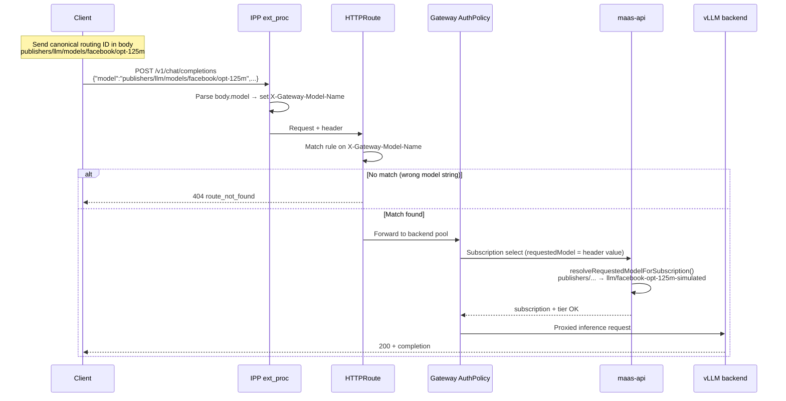
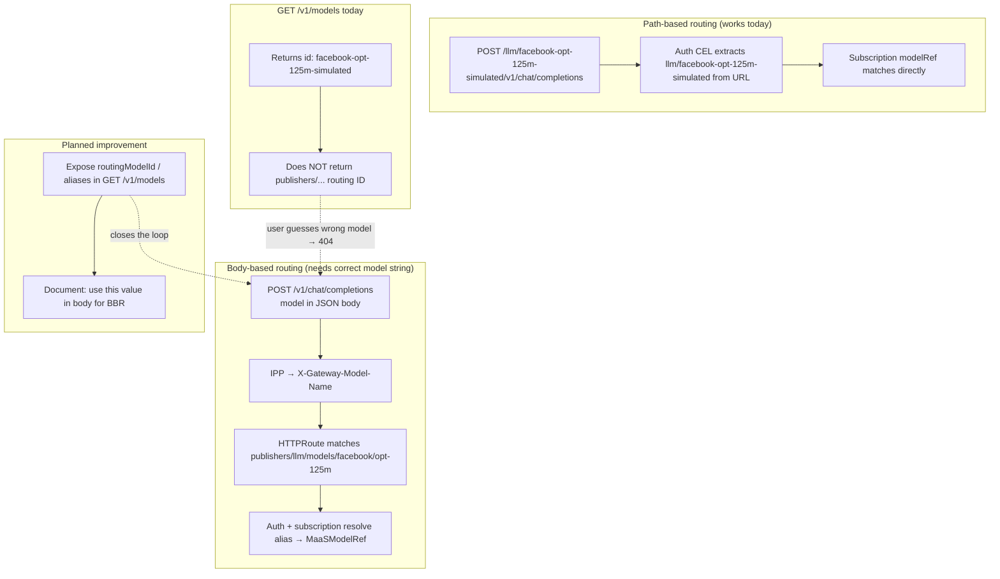

# Body-Based Routing and Model Identity

Architecture reference for how model identities flow through MaaS model discovery, gateway routing, and subscription/auth resolution.

**Related documentation:**

- [Model listing flow](docs/content/configuration-and-management/model-listing-flow.md) — `GET /v1/models` behavior
- [Model discovery user guide](docs/content/user-guide/model-discovery.md) — client-facing listing examples
- [MaaSModelRef CRD](docs/content/reference/crds/maas-model-ref.md) — CR fields including `status.modelAliases`

## Model identity (three names, one backend)

A single deployed model can be referenced by three different strings depending on the call path:

| Identity | Example | Used for |
|----------|---------|----------|
| **MaaSModelRef name** | `facebook-opt-125m-simulated` | Subscriptions, path routing, `GET /v1/models` `id` today |
| **OpenAI served ID** | `facebook/opt-125m` | What vLLM reports in the JSON `"model"` field |
| **KServe canonical ID** | `publishers/llm/models/facebook/opt-125m` | HTTPRoute header match for body-based routing (BBR) |



The maas-controller bridges these via `MaaSModelRef.status.modelAliases`, populated from the backing `LLMInferenceService`:

1. `namespace/name` — canonical MaaS identity (always first)
2. Values from `status.addresses[].models[].name`
3. Derived paths: `publishers/{namespace}/models/{servedName}` and the bare `servedName`

Source: `maas-controller/pkg/controller/maas/providers_llmisvc.go` (`collectModelAliases`).

## End-to-end architecture

```mermaid
flowchart TB
    subgraph client["Client"]
        C1["GET /v1/models"]
        C2["POST /v1/chat/completions<br/>{ \"model\": \"...\" }"]
        C3["POST /llm/facebook-opt-125m-simulated/v1/chat/completions"]
    end

    subgraph k8s["Kubernetes (controller + CRs)"]
        LLMISVC["LLMInferenceService<br/>served: facebook/opt-125m"]
        MMR["MaaSModelRef<br/>name: facebook-opt-125m-simulated<br/>status.modelAliases: [ns/name, publishers/..., facebook/opt-125m]"]
        AUTH["MaaSAuthPolicy<br/>allowlist expanded by aliases"]
        SUB["MaaSSubscription<br/>modelRefs: llm/facebook-opt-125m-simulated"]
        CTRL["maas-controller<br/>reconciles routes + aliases + auth"]
    end

    subgraph gateway["AI Gateway (RHCL / Envoy)"]
        GW["Gateway listener"]
        IPP["IPP ext_proc<br/>body-field-to-header plugin"]
        HDR["X-Gateway-Model-Name header"]
        HTR["HTTPRoute rules<br/>match header = publishers/llm/models/facebook/opt-125m"]
        AUTHZ["Authorino / AuthPolicy<br/>CEL: header or path → model identity"]
    end

    subgraph maasapi["maas-api"]
        DISC["GET /v1/models handler<br/>id = MaaSModelRef.name (no routing ID yet)"]
        SEL["POST /internal/v1/subscriptions/select<br/>resolve alias → subscription modelRef"]
    end

    subgraph backend["Inference backend"]
        VLLM["vLLM / LLMInferenceService pod"]
    end

    LLMISVC --> CTRL
    CTRL --> MMR
    CTRL --> HTR
    CTRL --> AUTH

    C1 --> GW --> DISC
    DISC --> MMR
    DISC -. "returns id only today" .-> C1

    C2 --> GW --> IPP
    IPP -->|"extract JSON model field"| HDR
    HDR --> HTR
    HTR --> AUTHZ
    AUTHZ -->|"alias-aware allowlist"| SEL
    SEL -->|"maps publishers/... → llm/facebook-opt-125m-simulated"| SUB
    AUTHZ --> VLLM

    C3 --> GW --> AUTHZ
    AUTHZ -->|"path: llm/facebook-opt-125m-simulated"| SEL
    AUTHZ --> VLLM
```

## Body-based routing sequence

For body-based routing, the client must send the **canonical routing ID** in the JSON `"model"` field (for example `publishers/llm/models/facebook/opt-125m`), not the MaaSModelRef name.



IPP reads the JSON `"model"` field and sets `X-Gateway-Model-Name` via the `body-field-to-header` plugin (`deployment/base/payload-processing/manager/plugins-configmap.yaml`).

Gateway auth CEL uses the header for `/v1/*` paths and the URL for path-based routes (`maas-controller/pkg/controller/maas/maasauthpolicy_controller.go`).

## Path-based vs body-based routing



## Layer summary

| Layer | What it uses | Example |
|-------|----------------|---------|
| `GET /v1/models` `id` | MaaSModelRef name | `facebook-opt-125m-simulated` |
| Path routing | URL segment | `/llm/facebook-opt-125m-simulated/...` |
| Body routing (HTTPRoute match) | KServe canonical ID in `"model"` | `publishers/llm/models/facebook/opt-125m` |
| Subscriptions / auth | Resolved via `status.modelAliases` | Any alias → `llm/facebook-opt-125m-simulated` |

## Alias resolution (auth and subscriptions)

When multiple `MaaSModelRef` resources share the same served model ID (for example in simulator environments), alias resolution picks the model that belongs to the caller's subscription:

- **Gateway auth:** allowlists are expanded to include all aliases; collisions merge allowlists (`maas-controller/pkg/controller/maas/model_identity.go`).
- **Subscription select:** `resolveRequestedModelForSubscription()` maps a requested alias to the canonical `namespace/name` in the subscription's `modelRefs` (`maas-api/internal/subscription/model_aliases.go`).

## Known gap

Auth and subscription alias resolution are wired, but **model discovery does not yet expose the body-routing canonical ID**. Users calling `GET /v1/models` see the MaaSModelRef name as `id` and have no API-visible way to learn which `"model"` value to send for body-based routing.

Planned fix: expose routing identifiers (via `aliases` or a dedicated field) in `GET /v1/models` and document the path-based vs body-based identity distinction.

## Example curl commands

```bash
# Path-based (uses MaaSModelRef name in URL)
curl -sS -H "Authorization: Bearer $API_KEY" -H "Content-Type: application/json" \
  -d '{"model":"facebook/opt-125m","messages":[{"role":"user","content":"Hello"}],"max_tokens":50}' \
  "${HOST}/llm/facebook-opt-125m-simulated/v1/chat/completions"

# Body-based (requires canonical routing ID in JSON model field)
curl -sS -H "Authorization: Bearer $API_KEY" -H "Content-Type: application/json" \
  -d '{"model":"publishers/llm/models/facebook/opt-125m","messages":[{"role":"user","content":"Hello"}],"max_tokens":50}' \
  "${HOST}/v1/chat/completions"
```
